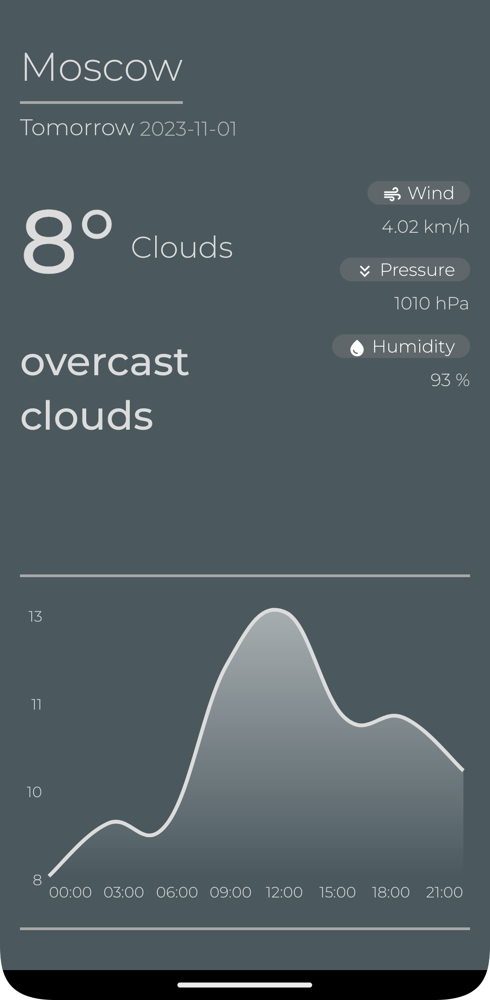

# WeatherForecastApp
Приложения для просмотра прогноза погоды. С помощью данного приложения можно просмотреть прогноз погоды в любом городе на несколько дней вперед=)

## Скриншоты 
<div>
  
  
</div>

## Библиотеки
```{Kotlin} {
implementation ("com.diogobernardino:williamchart:3.11.0") //Charts

implementation ("com.squareup.retrofit2:retrofit:2.9.0") // Работа с сетью
implementation ("com.squareup.okhttp3:logging-interceptor:4.9.3")

implementation ("com.google.dagger:hilt-android:2.48.1") // Внедрение зависимостей

implementation ("androidx.fragment:fragment-ktx:1.6.1") // Работа с фрагментами

implementation ("androidx.lifecycle:lifecycle-livedata-ktx:2.6.2") // Работа с ViewModel
implementation ("androidx.lifecycle:lifecycle-viewmodel-ktx:2.6.2")
```
